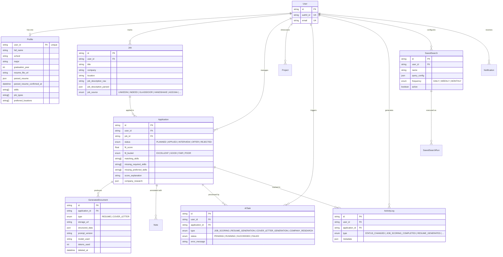

# Klevr

**An AI-powered career assistant that replaces scattered spreadsheets and generic resumes with intelligent job tracking, automated fit scoring, and LLM-generated documents tailored to every application.**

---

## Table of Contents

- [System Architecture](#system-architecture)
- [Engineering Highlights](#engineering-highlights)
- [Security](#security)
- [Features by Role](#features-by-role)
- [Screenshots](#screenshots)
- [Installation & Setup](#installation--setup)
- [Testing](#testing)
- [Architectural Decisions](#architectural-decisions)
- [Future Roadmap](#future-roadmap)

---

## System Architecture

### Tech Stack

| Layer                      | Technology                                             | Rationale                                                                                                                                                                                                             |
| -------------------------- | ------------------------------------------------------ | --------------------------------------------------------------------------------------------------------------------------------------------------------------------------------------------------------------------- |
| **Framework**              | Next.js 15 (App Router)                                | Server-first rendering with React Server Components. Nested layouts enable per-route auth guards and onboarding gating without wrapper components. API routes colocate with their pages for cohesive feature modules. |
| **Language**               | TypeScript 5 (strict mode)                             | Full type safety from Prisma-generated types through API boundaries to React components. Zod schemas enforce runtime validation at system edges while internal code trusts the type system.                           |
| **Database**               | Prisma 7 + Supabase (PostgreSQL)                       | Prisma's type-safe query builder eliminates raw SQL and generates TypeScript types directly from the schema. Supabase provides managed PostgreSQL with connection pooling.                                            |
| **Auth**                   | Auth0 (email/password + Google OAuth)                  | Enterprise-grade authentication with SSR cookie-based sessions via `@auth0/nextjs-auth0`. Post-login hooks sync Auth0 users to the application database on first sign-in.                                             |
| **AI - Generation**        | Anthropic Claude (`claude-sonnet-4-5-20250929`)        | Claude generates tailored resumes through a two-phase pipeline: semantic job analysis followed by structured content generation. Prefilled assistant message technique enables reliable JSON extraction.              |
| **AI - Scoring & Parsing** | OpenAI (`gpt-4o-2024-05-13`, `gpt-4o-mini-2024-07-18`) | GPT-4o-mini handles high-volume tasks (job parsing, fit explanation, company research) while GPT-4o powers cover letter generation. Pinned model IDs prevent silent behavior changes.                                 |
| **Background Jobs**        | Inngest                                                | Event-driven functions with step-level idempotency and automatic retries. All AI operations run asynchronously - the client never waits for an LLM response.                                                          |
| **File Storage**           | AWS S3                                                 | Presigned URLs for direct browser uploads (resumes) and server-side buffer uploads (generated PDFs). User-scoped storage keys prevent cross-tenant file access.                                                       |
| **PDF Generation**         | Puppeteer + marked                                     | Markdown-to-HTML-to-PDF pipeline with Chromium rendering. A custom one-page governor enforces A4 page constraints through semantic-aware content compression.                                                         |
| **UI**                     | Tailwind CSS 4 + shadcn/ui + Lucide                    | Utility-first styling with a custom design token system (cream/charcoal/orange/teal palette). shadcn/ui provides accessible, composable primitives.                                                                   |
| **Forms**                  | React Hook Form + Zod                                  | Schema-first validation - Zod schemas generate both runtime validation and TypeScript types from a single source of truth.                                                                                            |
| **Data Fetching**          | TanStack Query                                         | Client-side cache management with query key conventions. Eliminates raw `fetch` calls in components and provides automatic background refetching.                                                                     |
| **Testing**                | Vitest + Testing Library                               | Sub-second test execution with native ESM support. Test factories produce deterministic data without database dependencies.                                                                                           |
| **Deployment**             | Vercel                                                 | Zero-config deployment for Next.js with automatic preview environments per branch. Serverless functions handle API routes and Inngest webhooks.                                                                       |

### Data Model

The system is built around a 16-table PostgreSQL schema with application-level user scoping enforced on every query:



### AI Task Pipeline

All AI operations follow an asynchronous, event-driven pattern - the client never blocks on an LLM response:

```
Client POST /api/ai/resume
  │
  ├─ 1. Validate session + resume confirmation + usage limits
  ├─ 2. Create AiTask record (status: PENDING)
  ├─ 3. Send Inngest event ("resume/generate")
  └─ 4. Return task ID immediately
        │
        ▼
Inngest Function (async)
  │
  ├─ step.run("mark-running")     → AiTask.status = RUNNING
  ├─ step.run("semantic-analysis") → Claude: analyze job description
  ├─ step.run("generate-content")  → Claude: generate tailored resume
  ├─ step.run("render-pdf")        → Markdown → HTML → PDF (Puppeteer)
  ├─ step.run("upload-to-s3")      → Store PDF buffer in S3
  ├─ step.run("save-document")     → Create GeneratedDocument record
  └─ step.run("mark-succeeded")    → AiTask.status = SUCCEEDED
        │
        ▼
Client polls /api/ai-tasks/stream → Detects completion → Fetches document
```

Each `step.run()` is independently retryable and idempotent - if the function crashes mid-execution, Inngest resumes from the last completed step without re-running prior work.

---

## Engineering Highlights

### 1. Two-Phase Resume Generation with Semantic Analysis

**Problem:** Generic resume tailoring produces superficial keyword-stuffed documents. Simply matching skills from a job description misses the deeper intent - what the hiring manager actually values, which experiences demonstrate relevant competencies, and how to frame accomplishments for maximum impact.

**Solution:** Resume generation uses a two-phase Claude pipeline. Phase 1 (`semantic-analysis-v1`) analyzes the job description to produce a `SemanticJDAnalysis` - a structured assessment of role intent, core competencies, metric priorities, and per-entry relevance scores for every experience and project on the user's profile. Phase 2 (`generate-v3`) receives this analysis alongside the user's structured profile data and generates a tailored resume that emphasizes the highest-scored entries and reframes bullets to align with the job's core competencies.

```
Phase 1: Semantic Analysis (Claude Sonnet)
  Input:  Job description + user profile + projects
  Output: SemanticJDAnalysis {
            role_intent, core_competencies, metric_priorities,
            experience_scores[{ index, score, rationale }],
            project_scores[{ index, score, rationale }],
            bullet_guidance, skills_to_emphasize
          }

Phase 2: Content Generation (Claude Sonnet)
  Input:  SemanticJDAnalysis + structured profile data
  Output: GeneratedResumeContent {
            summary, experience[], education[], skills{}, projects[],
            section_order, professional_title
          }
```

This separation allows the generation model to make informed decisions about content priority rather than performing both analysis and writing in a single pass - reducing hallucination and improving section-level coherence.

### 2. One-Page Governor with Adaptive Content Compression

**Problem:** AI-generated resumes frequently exceed one page. Naive truncation destroys document coherence - removing the last section often drops the most relevant content. The system needs to intelligently compress content to fit A4 constraints while preserving the highest-impact information.

**Solution:** The one-page governor (`lib/one-page-governor.ts`) is a multi-pass compression pipeline that uses the semantic analysis scores to make informed pruning decisions. It operates on structured content (not raw text) through a graduated escalation sequence:

```
Step A: Semantic Redundancy Consolidation
  → Merge projects into matching experiences when >50% tech overlap

Step B: Soft-Skill Compression
  → Collapse "Other" skills category into Technical/Tools

TIGHTEN: Syntactic Bullet Compression
  → Pattern-match verbose lead-ins ("Responsible for" → "Led")
  → Replace wordy mid-sentence patterns ("in order to" → "to")

Step D: Bullet Density Reduction
  → Cap entries at 4 bullets, preserving metric-bearing bullets first

CONDENSE: Low-Priority Entry Condensation
  → Reduce lowest-scored entries to 2 bullets, then 1

Step C: Full Entry Removal
  → Remove entire entries bottom-up by semantic relevance score

REEXPAND: Page-Fill Optimization
  → If compression freed excess space, restore highest-value pruned
    bullets until reaching 95% page density
```

A calibrated line counter (`CHARS_PER_LINE = 105`, `MAX_LINES = 64`) models the actual Puppeteer rendering output - accounting for font sizes (h1=24px, h2=13pt, body=11pt, bullets=10pt), A4 dimensions, and CSS margins. The governor never operates on rendered output; it predicts fit from structured content and regenerates markdown only to verify.

### 3. Hybrid Fit Scoring with Weighted Multi-Signal Analysis

**Problem:** A simple keyword-matching approach to job fit scoring produces misleading results - a job that matches 8/10 skills but requires 5 years of experience should score differently than one matching 6/10 skills at entry level. Users need scores that reflect their actual candidacy, not just vocabulary overlap.

**Solution:** Fit scoring combines local computation with AI-powered parsing in a three-component weighted model:

```
Component 1: Skills Match (50% weight)
  → Fuzzy matching via lib/skills-matcher.ts
  → Handles aliases ("JS" ↔ "JavaScript"), partial matches, category grouping
  → Separately tracks required vs. preferred skill gaps

Component 2: Experience & Education (30% weight)
  → Base score for having any experience (0.15)
  → Education relevance: major alignment with job requirements (+0.05)
  → Experience relevance: title/domain overlap (+0.05)
  → Project portfolio presence (+0.05)

Component 3: Preference Alignment (20% weight)
  → Job type match against user preferences (+0.10)
  → Location match including remote detection (+0.10)

Score → Bucket: ≥0.8 EXCELLENT | ≥0.6 GOOD | ≥0.4 FAIR | <0.4 POOR
```

The job description is first parsed by GPT-4o-mini into a `ParsedJobDescription` (extracting required skills, preferred skills, experience level, domain, and job type), then the local scoring function runs deterministically against the user's profile. GPT-4o-mini then generates a natural-language explanation of the score. This separation keeps the expensive parsing step cacheable (saved to `Job.job_description_parsed`) while the scoring logic remains a pure, testable function with no AI dependency.

### 4. Versioned Prompt Architecture with YAML Frontmatter

**Problem:** Prompt engineering is iterative - prompts change frequently as output quality is tuned. Hardcoding prompts in application code makes iteration slow, version tracking impossible, and A/B testing impractical. The system needs prompts to be first-class artifacts with metadata.

**Solution:** All 11 AI prompts live in `prompts/` as standalone markdown files with YAML frontmatter:

```yaml
---
version: '3.0'
description: 'Generate a tailored resume using semantic analysis'
model: 'claude-sonnet-4-5-20250929'
maxTokens: 4096
---
You are a professional resume writer...
```

A `loadPrompt()` utility reads these files at runtime, extracting both the template content and metadata (version, target model, token budget). Every `GeneratedDocument` record stores the `prompt_version` and `model_used` at generation time, creating a complete audit trail. When a prompt is updated, existing documents remain tied to their original version - enabling quality comparison across prompt iterations without regenerating historical documents.

---

## Security

Klevr enforces data isolation through **application-level user scoping** - every database query is filtered by `user_id` at the Prisma call site, ensuring no cross-tenant data access is possible even if an API endpoint has a logic bug.

- **User scoping on every query** - Every `prisma.findMany()` includes `where: { user_id }`, every `findUnique()` verifies ownership after fetch, and every `update()`/`delete()` includes both `id` and `user_id` in the where clause. This is enforced as a codebase invariant, not a suggestion.
- **Auth0 session management** - Cookie-based sessions via `@auth0/nextjs-auth0` with Auth0 middleware on every route. Sessions are validated server-side - no client-side token handling or local storage.
- **Resume confirmation gate** - AI features (job scoring, resume generation, cover letters) are gated behind `parsed_resume_confirmed_at`. Until the user explicitly confirms their parsed resume is accurate, no AI tasks can be created - preventing the system from generating documents based on incorrectly parsed input.
- **Per-user rate limiting** - An in-memory rate limiter enforces 60 AI requests per minute per user. Monthly usage caps (200 job scores, 30 resumes, 30 cover letters) are tracked in the `UsageTracking` table and checked before every AI task creation.
- **Presigned URL isolation** - Resume uploads and document downloads use short-lived S3 presigned URLs (5-minute upload, 15-minute download). Storage keys are prefixed with `user_id` or `application_id`, preventing URL guessing attacks.
- **Server-only secrets** - All API keys (`ANTHROPIC_API_KEY`, `OPENAI_API_KEY`, `AWS_SECRET_ACCESS_KEY`, `INNGEST_SIGNING_KEY`) are server-only environment variables with no `NEXT_PUBLIC_` prefix. Next.js enforces this at build time.
- **Structured error classes** - AI failures use typed error classes (`AIError`, `RateLimitError`, `TimeoutError`, `ValidationError`, `UsageLimitError`) that never expose internal details to the client. Error messages are sanitized before reaching the API response.
- **Soft deletion for documents** - Generated documents use a `deleted_at` timestamp rather than hard deletion, enabling restoration and preventing accidental data loss.

---

## Features by Role

### Onboarding Flow

- Three-step guided setup: basics (name, school, major) → preferences (job types, locations) → resume upload
- Upload resume as PDF or DOCX - AI parses it into structured sections (education, experience, projects, skills)
- Review and confirm parsed resume before AI features activate
- Skills extraction and manual refinement via tag-based editor

### Job Tracking & Discovery

- Add jobs manually with title, company, description, source, and URL
- Discover jobs through integrated Adzuna search with keyword, location, and salary filters
- Save searches with configurable frequency (daily/weekly/monthly) and in-app notifications for new matches
- Track application status through a visual pipeline: Planned → Applied → Interview → Offer → Rejected
- Filter and search across all tracked jobs by status, fit score, company, or keyword

### AI-Powered Analysis

- **Fit Scoring** - Automated job fit analysis with skills matching, experience alignment, and preference scoring. Results include matching skills, missing required skills, missing preferred skills, and a natural-language explanation
- **Company Research** - AI-generated company overview with culture insights, recent news, and interview preparation tips
- **Activity Timeline** - Chronological log of all actions on each application (status changes, score completions, document generations)

### Document Generation

- **Tailored Resumes** - Two-phase AI generation produces resumes optimized for specific job descriptions, with semantic analysis guiding content selection and professional formatting
- **Cover Letters** - AI-generated cover letters that reference the user's specific experience and the target role's requirements
- **PDF Output** - Professional A4 documents rendered through Chromium with consistent typography and one-page enforcement
- **Document Management** - Download, rename, soft-delete, and restore generated documents. Version history tracks prompt version and model used

### Profile Management

- Structured profile with education, job experience entries, and project portfolio
- Bullet bank for reusable accomplishment statements across applications
- Skills management with tag-based input
- Usage dashboard showing monthly AI operation consumption against limits

---

## Screenshots

> _Screenshots coming soon._

| View                             | Description                                                                            |
| -------------------------------- | -------------------------------------------------------------------------------------- |
| `[Screenshot: Dashboard]`        | Application pipeline with status cards, fit score distribution, and recent activity    |
| `[Screenshot: Job Detail]`       | Job description with fit assessment, skills analysis, and generated documents          |
| `[Screenshot: Job Discovery]`    | Adzuna-powered search with filters, saved searches, and one-click application tracking |
| `[Screenshot: Resume Review]`    | Parsed resume editor with section-by-section confirmation                              |
| `[Screenshot: Generated Resume]` | AI-tailored resume PDF with semantic optimization                                      |
| `[Screenshot: Profile]`          | Structured profile with experience, projects, education, and bullet bank               |

---

## Installation & Setup

### Prerequisites

- **Node.js** 18+ and npm
- A **Supabase** account ([supabase.com](https://supabase.com)) or any PostgreSQL instance
- An **Auth0** account ([auth0.com](https://auth0.com))
- An **AWS** account with an S3 bucket configured
- **Anthropic** and **OpenAI** API keys

### 1. Clone and Install

```bash
git clone https://github.com/TylerJarvis3256/Klevr.git
cd Klevr
npm install
```

### 2. Environment Variables

Copy the example file and fill in your credentials:

```bash
cp .env.example .env.local
```

| Variable                | Visibility      | Purpose                                  |
| ----------------------- | --------------- | ---------------------------------------- |
| `DATABASE_URL`          | **Server only** | Supabase PostgreSQL connection string    |
| `AUTH0_SECRET`          | **Server only** | Auth0 session encryption secret          |
| `AUTH0_DOMAIN`          | **Server only** | Auth0 tenant domain                      |
| `AUTH0_CLIENT_ID`       | **Server only** | Auth0 application client ID              |
| `AUTH0_CLIENT_SECRET`   | **Server only** | Auth0 application client secret          |
| `AUTH0_BASE_URL`        | **Server only** | Application base URL for Auth0 callbacks |
| `AUTH0_ISSUER_BASE_URL` | **Server only** | Auth0 issuer URL                         |
| `ANTHROPIC_API_KEY`     | **Server only** | Anthropic Claude API access              |
| `OPENAI_API_KEY`        | **Server only** | OpenAI API access                        |
| `AWS_ACCESS_KEY_ID`     | **Server only** | AWS IAM access key                       |
| `AWS_SECRET_ACCESS_KEY` | **Server only** | AWS IAM secret key                       |
| `AWS_REGION`            | **Server only** | S3 bucket region                         |
| `AWS_S3_BUCKET`         | **Server only** | S3 bucket name                           |
| `INNGEST_EVENT_KEY`     | **Server only** | Inngest event ingestion key              |
| `INNGEST_SIGNING_KEY`   | **Server only** | Inngest webhook signature verification   |
| `NEXT_PUBLIC_APP_URL`   | Public          | Application base URL                     |
| `APP_BASE_URL`          | **Server only** | Server-side base URL                     |

### 3. Database Setup

```bash
npm run db:migrate    # Run Prisma migrations
npm run db:seed       # Seed initial data (optional)
```

### 4. Run the Development Server

```bash
npm run dev           # Start Next.js dev server (port 3000)
npm run dev:inngest   # Start Inngest dev server (separate terminal)
```

Open [http://localhost:3000](http://localhost:3000). Sign up via Auth0 - the post-login hook automatically creates a `User` and `Profile` record, then redirects to the onboarding flow.

### 5. Available Scripts

| Command                 | Description                                           |
| ----------------------- | ----------------------------------------------------- |
| `npm run dev`           | Start Next.js development server                      |
| `npm run dev:inngest`   | Start Inngest development server                      |
| `npm run build`         | Production build                                      |
| `npm run lint`          | ESLint (flat config)                                  |
| `npm run typecheck`     | TypeScript type checking                              |
| `npm run format`        | Prettier format all files                             |
| `npm run db:migrate`    | Run Prisma migrations                                 |
| `npm run db:studio`     | Open Prisma Studio (database GUI)                     |
| `npm run db:seed`       | Seed database                                         |
| `npm run db:reset`      | Reset database (drop all tables, re-migrate, re-seed) |
| `npm test`              | Run all tests (Vitest)                                |
| `npm run test:watch`    | Watch mode                                            |
| `npm run test:coverage` | Coverage report                                       |
| `npm run test:ui`       | Open Vitest UI                                        |
| `npm run test:e2e`      | Run Playwright end-to-end tests                       |

---

## Testing

The project includes unit and integration tests covering AI pipelines, scoring logic, content governance, and utility functions.

```bash
npm test              # Run all tests
npm run test:watch    # Watch mode
npm run test:coverage # With coverage report
npm run test:ui       # Vitest browser UI
```

### Test Architecture

| Category               | Files                        | What's Tested                                                    |
| ---------------------- | ---------------------------- | ---------------------------------------------------------------- |
| **AI Clients**         | `anthropic.test.ts`          | Prefilled JSON extraction, rate limiting, error handling         |
| **Resume Engine**      | `resume-engine-v3.test.ts`   | Two-phase generation pipeline, structured output validation      |
| **One-Page Governor**  | `one-page-governor.test.ts`  | Multi-pass compression, line counting, re-expansion logic        |
| **Semantic Analysis**  | `semantic-analyzer.test.ts`  | Job description analysis, relevance scoring                      |
| **Skills Matching**    | `skills-matcher.test.ts`     | Fuzzy matching, alias resolution, required vs. preferred scoring |
| **Bullet Scoring**     | `bullet-scorer.test.ts`      | Metric detection (currency, percentage, multiplier, count, time) |
| **Markdown Rendering** | `resume-to-markdown.test.ts` | Structured content to markdown conversion                        |
| **PDF Rendering**      | `renderer.test.ts`           | React PDF component output validation                            |
| **Error Classes**      | `errors.test.ts`             | AIError hierarchy, error serialization                           |
| **Utilities**          | `utils.test.ts`              | Date formatting, month calculation, string helpers               |

### Key Testing Patterns

- **Test factories:** `createUser()`, `createJob()`, `createApplication()`, `createProfile()`, `createSemanticAnalysis()`, etc. produce deterministic test data with `Partial` overrides and counter-based unique IDs
- **Mock architecture:** `createMockPrisma()` provides a fully-mocked Prisma client where every model method is a `vi.fn()`. `createMockAuth0Session()` and `createMockOpenAIResponse()` handle external service boundaries
- **Pure function extraction:** Business-critical logic (fit scoring, one-page governance, skills matching, bullet scoring) lives in `lib/` as pure functions - testable without database connections or API mocks
- **Hoisted mocks for Anthropic:** The Anthropic client uses `vi.hoisted()` to declare mock variables before `vi.mock()` runs, ensuring the mock is available at module initialization time

---

## Architectural Decisions

These are deliberate trade-offs, not framework defaults:

- **Asynchronous AI via Inngest, never synchronous** - Every AI operation (scoring, generation, research) runs as an Inngest background function with step-level idempotency. This means a user requesting a resume generation gets an immediate response with a task ID, and the heavy LLM work happens outside the request lifecycle. The trade-off is polling complexity on the client, but it eliminates request timeouts, enables automatic retries, and makes the system resilient to transient API failures from OpenAI and Anthropic.

- **Dual-LLM strategy: Claude for generation, OpenAI for parsing** - Resume generation requires nuanced understanding of professional narrative and formatting, where Claude Sonnet excels. Job parsing and fit explanation are structured extraction tasks where GPT-4o-mini provides adequate quality at significantly lower cost and latency. Pinned model IDs (`claude-sonnet-4-5-20250929`, `gpt-4o-2024-05-13`, `gpt-4o-mini-2024-07-18`) prevent silent behavior changes when providers update their models.

- **Application-layer user scoping, not database-level RLS** - Unlike a multi-tenant SaaS with shared tables, Klevr scopes every query by `user_id` at the Prisma call site. This is more explicit than Row-Level Security policies and easier to audit - grep for `user_id` in any query to verify scoping. The trade-off is that a missing `where: { user_id }` is a bug rather than a policy violation, but this is enforced as a codebase invariant through code review and testing conventions.

- **Markdown as the intermediate resume format** - Rather than generating HTML or PDF directly, the AI produces markdown which is converted to HTML (via `marked` with inline CSS) and then to PDF (via Puppeteer). This creates a clean separation: the AI controls content and structure, the HTML template controls visual styling, and Puppeteer handles pixel-perfect rendering. The governor operates on markdown line counts, not pixel measurements, which is faster and more predictable.

- **Resume confirmation as an AI feature gate** - The `parsed_resume_confirmed_at` field on `Profile` gates all AI operations. Until the user reviews and explicitly confirms their parsed resume, no AI tasks can be created. This prevents the system from generating documents based on incorrectly parsed input (e.g., a malformed PDF that extracted garbled text). The confirmation step also serves as a natural onboarding checkpoint.

- **Prompt templates as versioned markdown files** - AI prompts live in `prompts/` as standalone `.md` files with YAML frontmatter specifying version, model, and token budget. This keeps prompts out of application code, enables version tracking, and makes prompt iteration as simple as editing a markdown file. Every generated document records its `prompt_version`, creating a complete lineage from prompt to output.

---

## Future Roadmap

- **Real-time task updates** - Replace polling with Server-Sent Events or WebSocket push for AI task completion notifications
- **Resume template selection** - Multiple PDF templates (ATS-optimized, modern, academic) selectable per generation
- **Interview preparation** - AI-generated interview questions based on job description and user profile gaps
- **Email notifications** - Resend integration for saved search alerts, application deadline reminders, and document completion
- **Analytics dashboard** - Application success rates, score distribution trends, and skills gap analysis over time
- **Bulk job import** - CSV/JSON import for users migrating from spreadsheet-based tracking
- **Mobile optimization** - Responsive refinements for on-the-go application tracking

---

## Project Structure

```
app/
├── (auth)/              Auth pages - login, signup (public routes)
├── (main)/              Authenticated pages - dashboard, jobs, profile, settings
│   ├── dashboard/       Application pipeline with status cards and activity feed
│   ├── jobs/            Job list, detail views, and job discovery (Adzuna search)
│   ├── profile/         Structured profile editor (experience, projects, bullets)
│   └── settings/        Account management, usage tracking, notifications
├── (onboarding)/        Three-step guided setup - basics → preferences → resume
├── api/                 API routes organized by resource
│   ├── ai/              AI task creation (job-scoring, resume, cover-letter, research)
│   ├── applications/    Application CRUD, status updates, timeline
│   ├── documents/       Generated document download, rename, delete, restore
│   ├── jobs/            Job CRUD and Adzuna search integration
│   ├── profile/         Profile management (basics, skills, preferences, projects)
│   ├── resume/          Resume upload, parse, confirm, update
│   └── settings/        Usage tracking and account deletion
└── auth/callback/       Auth0 callback handler

components/
├── ui/                  shadcn/ui primitives (button, dialog, form, select, etc.)
├── dashboard/           Pipeline view, stat cards, filter bar, application cards
├── jobs/                Job detail tabs, fit assessment, documents list, discovery
├── profile/             Resume editor, bullet bank, experience/project editors
├── forms/               Reusable form components (file upload, skills input, etc.)
├── layout/              Navbar, sidebar, mobile navigation
└── notifications/       Notification center and bell indicator

lib/
├── pdf/                 PDF pipeline - markdown-to-html, html-to-pdf, content estimator
├── markdown/            Resume-to-markdown conversion
├── hooks/               React hooks (SSE task polling)
├── __tests__/           Unit and integration tests
├── anthropic.ts         Claude client with rate limiting and JSON extraction
├── openai.ts            OpenAI client with rate limiting and timeout handling
├── fit-scorer.ts        Weighted multi-signal fit scoring (pure function)
├── skills-matcher.ts    Fuzzy skills matching with alias resolution
├── semantic-analyzer.ts Job description semantic analysis
├── resume-engine-v3.ts  Two-phase resume generation pipeline
├── one-page-governor.ts Adaptive content compression for A4 constraints
├── ai-tasks.ts          AI task lifecycle management
├── usage.ts             Monthly usage tracking and limit enforcement
├── s3.ts                S3 client with presigned URL generation
├── auth.ts              Auth0 session helpers and user lookup
├── prisma.ts            Prisma client singleton
└── errors.ts            Typed error hierarchy for AI operations

inngest/
├── client.ts            Inngest client configuration
└── functions/           Background job handlers
    ├── job-scoring.ts        Parse job + calculate fit + explain score
    ├── resume-generation.ts  Semantic analysis + content generation + PDF rendering
    ├── cover-letter-generation.ts  Generate + render cover letter PDF
    ├── resume-parse.ts       Parse uploaded resume into structured data
    ├── company-research.ts   Generate company research summary
    └── run-saved-searches.ts Execute saved Adzuna searches on schedule

prompts/                 AI prompt templates (markdown + YAML frontmatter)
├── resume/              Resume parsing, generation (v1, v3), semantic analysis
├── scoring/             Job description parsing, fit explanation
├── cover-letter/        Cover letter generation
├── bullets/             Bullet enhancement and suggestion
└── research/            Company research

prisma/
├── schema.prisma        16-table schema with comprehensive indexing
└── migrations/          Sequential SQL migrations

__tests__/helpers/       Test infrastructure
├── factories.ts         Deterministic data factories for all models
├── mocks.ts             Mock utilities (Prisma, Auth0, OpenAI, S3, Inngest)
└── index.ts             Barrel export
```

---

## License

MIT License - see [LICENSE](LICENSE) for details.
